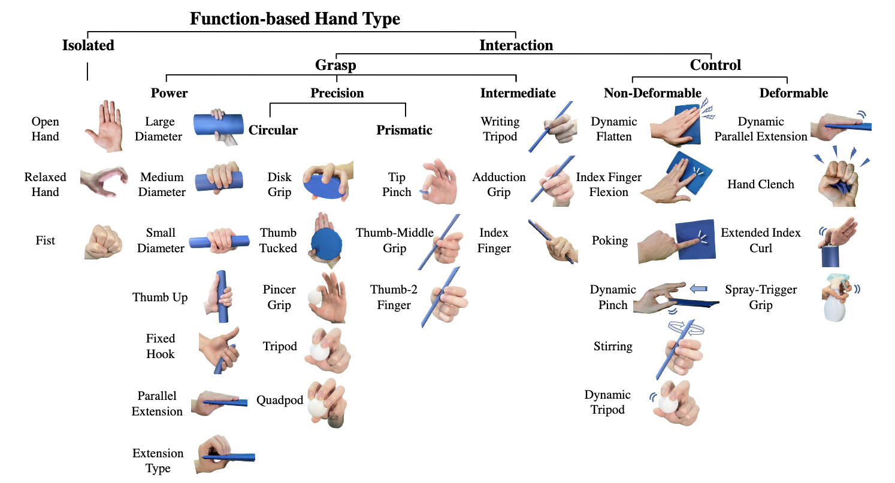

# :wave: Functional Hand Type Prior for 3D Hand Pose Estimation and Action Recognition from Egocentric View Monocular Videos
  
 
Original implementation of the paper "Functional Hand Type Prior for 3D Hand Pose Estimation and Action Recognition from Egocentric View Monocular Videos"

[[Paper]](https://papers.bmvc2023.org/0193.pdf)


 

## :clipboard:  Requirements

### Environment

The code is tested with the following environment:

```

Ubuntu 20.04

python 3.9

pytorch 1.10.0

torchvision 0.11.0

```


Other dependent packages as included in ```requirements.txt``` can be installed by pip. Note that we also refer to the utility functions in [```libyana```](https://github.com/hassony2/libyana). To install this ```libyana``` library, we follow [LPC, CVPR 2020](https://github.com/hassony2/handobjectconsist/blob/master/environment.yml/#L35) to run:

```

pip install git+https://github.com/hassony2/libyana@v0.2.0

```

  
### Data Preprocessing


To facilitate computation, for downloaded [FPHA](https://guiggh.github.io/publications/first-person-hands/) and [H2O](https://taeinkwon.com/projects/h2o/) datasets: We resize all images into the 480x270 pixels, and use lmdb to manage the training images. One may refer to the ```preprocess_utils.py``` for related functions.

  
### Pretrained Model

Our pretrained weights for FPHA and H2O are located in ```./ws/ckpts/fhtp/```.


## :tennis: Training

### Train FPHA

```

python train.py --batch_size 2 --dataset_folder /data/fphab/ --train_dataset fhbhands --experiment_tag base_fpha --snapshot 2

```

### Train H2O

```

python train.py --batch_size 2 --dataset_folder /data/h2o/ --train_dataset h2ohands --experiment_tag base_h2o --snapshot 2

```


## :golf: Evaluation

### Evaluate for Hand Pose Estimation and Action Recognition

```

CUDA_VISIBLE_DEVICES=0 python eval.py --batch_size <batch_size> --val_split <val_split> --train_dataset <dataset> --val_dataset <dataset> --dataset_folder <path_to_dataset_root> --resume_path <path_to_pth>

```
for evaluation on the dataset and split given by ```<dataset>``` and ```<val_split>```.

Note that for the test split of H2O, we report the hand MEPE and action recall rate by referring to our submitted results in the [H2O challenge codalab](https://taeinkwon.com/projects/h2o/).

### Plot 3D PCK(-RA) Curves for Hand Pose Estimation

```

python plot_pck_curves.py

```

to plot the curves the 3D PCK(-RA) at different error thresholds on FPHA and H2O.

### Demo
```

CUDA_VISIBLE_DEVICES=0 python eval.py --batch_size <batch_size> --val_split <val_split> --train_dataset <dataset> --val_dataset <dataset> --dataset_folder <path_to_dataset_root> --resume_path <path_to_pth> --is_demo

```
